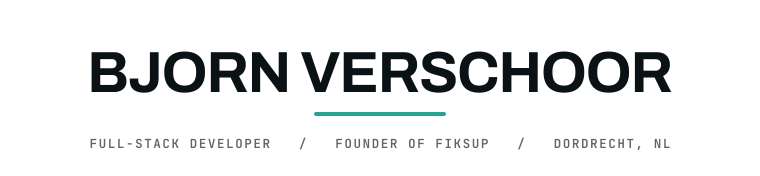
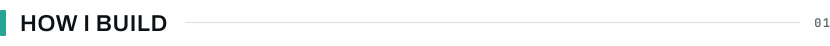
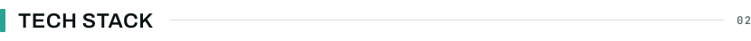
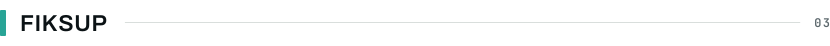
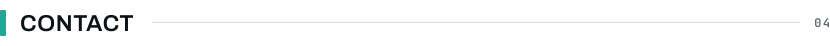

<picture>
  <source media="(prefers-color-scheme: dark)" srcset="./assets/header-dark.svg">
  
</picture>

&nbsp; &nbsp; &nbsp; 

<picture>
  <source media="(prefers-color-scheme: dark)" srcset="./assets/divider-dark.svg">
  
</picture>

I am Bjorn Verschoor, a developer from Dordrecht in the Netherlands. Together with [Richie van der Heij](https://github.com/Richievdheij) I run **FiksUp**, a two-person operation where we build the product and the machine that ships it: the applications, the infrastructure they run on, and the automation that keeps both honest.

Most of that work is **multi-tenant B2B SaaS**. Every client gets their own site, their own content and their own daily operations, all on one codebase that has to stay correct while it keeps growing. That constraint drives almost every technical decision I make.

Alongside FiksUp I study **Software Development (MBO-4)** at ROC Da Vinci College. Running a platform in production is the part of my education that actually teaches me the most.

<h3><picture><source media="(prefers-color-scheme: dark)" srcset="./assets/heading-how-i-build-dark.svg"></picture></h3>

- **Architecture**: a monorepo with Feature-Sliced Design on the frontend and a strict Controller → Service → Repository chain on the backend. Layers reference downward only, and slices talk to each other through an explicit public API.
- **Multi-tenancy**: a shared schema with guards in the application layer and PostgreSQL Row Level Security underneath, so tenant isolation never depends on someone remembering a `WHERE` clause.
- **Type safety**: TypeScript in strict mode, where `any` and suppressions count as defects. Shared contract packages hold the shapes, so a change breaks the build everywhere at once instead of quietly in production.
- **Enforcement**: architecture a machine can check. Layer boundaries, dependency direction, linting and tests run in CI on every branch, because a reviewer should not be the only thing between a violation and `main`.
- **Operations**: we run the platform ourselves. Docker and Traefik on a VPS, encrypted secrets versioned next to the code, object storage with automated backups, and build, deploy and alert notifications piped straight into the team channel.
- **Principles**: SOLID, DRY, KISS, separation of concerns, small focused units, and a commit history someone else can read.

<h3><picture><source media="(prefers-color-scheme: dark)" srcset="./assets/heading-stack-dark.svg"></picture></h3>

<h4><picture><source media="(prefers-color-scheme: dark)" srcset="./assets/subheading-core-dark.svg"></picture></h4>

| Layer | Stack |
| :--- | :--- |
| **Language** | TypeScript (strict mode) |
| **Frontend** | Vue 3 and Nuxt 4 (Composition API, Pinia, i18n), Feature-Sliced Design, SCSS with design tokens, SSR / SSG / SPA |
| **Backend** | NestJS and Node.js, versioned REST APIs, OpenAPI |
| **Data** | PostgreSQL and TypeORM (migration-owned schema, Row Level Security), Payload CMS |
| **Infra & DevOps** | Docker and Traefik, GitHub Actions, SOPS and age, Cloudflare R2, Resend |
| **Auth & Access** | Better Auth (sessions, cross-subdomain SSO, TOTP 2FA, organizations), role-based access control |
| **Tooling** | pnpm workspaces and Turborepo, ESLint and Prettier, Git and GitHub, Figma |

<h3><picture><source media="(prefers-color-scheme: dark)" srcset="./assets/heading-fiksup-dark.svg"></picture></h3>

[**FiksUp**](https://fiksup.nl) is the platform Richie and I design, build and operate, the two of us and nobody else. Every client gets a website on their own domain and in their own branding, a **CMS** for their content, and a **dashboard** for the daily operations around it. Most of them are construction and trades companies, the kind of business that wants a site that works and then never wants to think about it again.

Two people is also why the architecture is as strict as it is. There is no room for a codebase only one of us understands, and no room for a rule that a reviewer has to remember, so the boundaries are enforced by CI instead.

The plans cover the common cases, and we take on custom work when a client needs something specific. The rest is on [fiksup.nl](https://fiksup.nl).

The source stays private, but FiksUp is open for business. A partnership, an offer, or something we build together: if it works for both sides, we want to hear it.

&nbsp; &nbsp; &nbsp; &nbsp; &nbsp; 

Business inquiries: <a href="mailto:info@fiksup.nl">info@fiksup.nl</a>

<h3><picture><source media="(prefers-color-scheme: dark)" srcset="./assets/heading-contact-dark.svg"></picture></h3>

Open to freelance work, collaborations, and good engineering conversations. I work in Dutch and English. Reach me by [mail](mailto:verschoorsb@gmail.com), on [LinkedIn](https://www.linkedin.com/in/bjorn-verschoor-50b754212/), or through any of the accounts above.

<picture>
  <source media="(prefers-color-scheme: dark)" srcset="./assets/divider-dark.svg">
  
</picture>
